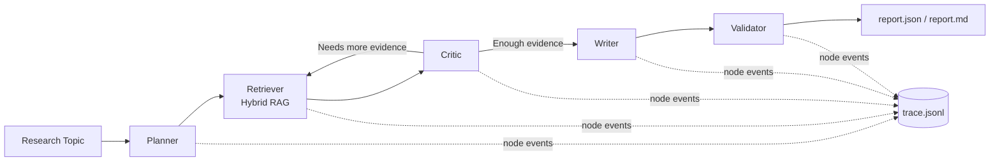

# MTG AI Deck Builder
_Unleash the power of **Machine Learning** to forge next-level **Magic: The Gathering** decks that adapt to the ever-evolving **Commander** meta!_

[](#)
[](#)
[](#)
[](https://github.com/CathGrvt/mtg_deck_builder/actions/workflows/ci.yml)

## Fork Context + My Contributions
This repository is a fork of [`georgejieh/mtg_ai_deck_builder`](https://github.com/georgejieh/mtg_ai_deck_builder).  
The work in this fork focuses on adding a production-style agentic research stack, evals, and observability on top of the original deck-analysis/generation foundation.

### What I Added On Top of the Fork
- `research_pipeline/`: end-to-end agentic loop (`planner -> retriever -> critic -> writer -> validator`) with optional LangGraph runtime and manual-loop fallback.
- `research_pipeline/retrieval/`: hybrid retrieval (`lexical + semantic`) over local MTG corpus sources (decklists, card DB, meta JSON).
- `research_pipeline/eval/` + `run_research_eval.py`: eval harness with groundedness, faithfulness, citation precision/recall, and failure classification.
- `research_pipeline/trace.py`: node-level trace logging to `trace.jsonl` for debugging and regression analysis.
- `mtg_ui_app/agentic_tab.py` and `mtg_ui_app/chat_tab.py`: Streamlit interfaces for agentic report generation and retrieval-grounded chat.
- Dockerized local UI workflow (`Dockerfile.ui`, `docker-compose.yml`) for reproducible runs.

### Agentic Architecture


### Eval Scope and Artifacts
- Starter eval dataset: `eval/topics.jsonl` currently contains **24** research cases.
- Cases include `category` and `difficulty` metadata for stratified analysis (see `docs/eval_dataset.md`).
- Each run writes to `eval_runs/<timestamp>/`:
  - `results.jsonl`
  - `summary.md`
  - `failure_analysis.md`
  - `trace.jsonl`
- Failure taxonomy includes: `retrieval_miss`, `bad_citation`, `hallucinated_claim`.
- Published benchmark snapshots are tracked in `eval/benchmarks/` (latest: `2026-05-15_rule_lexical.json`).

### Runtime Modes (No API Key vs API Key)
| Capability | No `OPENAI_API_KEY` | With `OPENAI_API_KEY` |
|---|---|---|
| Agentic pipeline synthesis | Deterministic `RuleBasedLLM` fallback | OpenAI chat synthesis |
| Chatbot synthesis | Retrieval + rule-based answer synthesis | Retrieval + OpenAI answer synthesis |
| Deck generator reranking | Disabled; baseline scoring only | Enabled via `--llm-rerank-top-k` |

### CI/Test Status
- Test suite exists under `tests/` and can be run with `pytest`.
- GitHub Actions CI (`.github/workflows/ci.yml`) runs tests on push/PR and publishes a status badge.

## Overview
**MTG AI Deck Builder** aims to train a **dynamic**, unsupervised **AI model** that consistently updates itself to generate competitive **Commander** decks (with optional support for other formats). By tapping into the **Scryfall** API for card data, it analyzes existing decks and the broader meta—ultimately discovering creative synergies and archetype strategies that might be overlooked by the community.

### Why This Project?
- **Adaptive Metagame Analysis**: Stay ahead of format shifts by re-training on newly released sets or emergent archetypes.
- **Unsupervised Creativity**: Rely on an unsupervised learning framework to find unexpected or "under-the-radar" combinations.
- **Data-Driven**: Harness card data from Scryfall, letting the model continuously refine deck lists as the meta evolves.
- **Solo & Open-Source**: This is primarily a solo project, but feel free to fork and experiment on your own!

## Current Status
> :warning: **Work in progress**: The project features multiple analysis approaches with varying degrees of sophistication.

- **[`fetch_standard_legal_cards.py`]**  
  Despite the legacy filename, this script now fetches cards for any format (default: Commander) from the Scryfall API and outputs them as a CSV dataset. It handles various card layouts—including split cards and Room cards—and extracts comprehensive card data such as types, colors, keywords, and mechanics. Switch formats by passing `--format <format-name>`.

- **[`deck_analysis.py`]**  
  Analyzes an input deck list to produce baseline archetype insights and Commander compliance checks. In addition to archetype tagging (Aggro, Midrange, Control, Tempo, Combo), it now validates commander color identity, singleton rules, ramp density, companion usage, and deck-size requirements while still detailing mana curve, card compositions, and mechanic distributions.

- **[`current_standard_deck_list_scraper.py`]**  
  Scrapes the latest Commander (or other format) deck lists from MTGGoldfish's metagame page. Allows filtering by minimum meta percentage, saves deck lists (with preserved Commander/Deck headers) as text files for analysis, and exports meta representation data as JSON. Use `--format commander` (default) or swap formats as needed.

- **[`ai_deck_generator.py`]**  
  A first-pass, meta-driven **deck generator**. It uses the same card database and scraped decklists as the analysis scripts, building simple frequency statistics over the existing meta. Given a requested format, color identity, and optional archetype hint, it produces a complete decklist by:
  - Filtering the card pool by color identity and basic Commander/constructed rules  
  - Favoring cards that appear more often in the current meta  
  - Enforcing approximate land ratios and copy limits (Commander singleton vs. 4-of)  
  This module is intentionally simple and model-agnostic so it can later be upgraded to use neural generators and semantic embeddings while keeping the same `DeckSpec` interface.

## Key Features
1. **Scryfall Integration**  
   Automatically pulls the latest **Commander**-legal cards (or any supported format via `--format`), ensuring the model is always up-to-date.
2. **Deck Archetype Analysis**  
   Categorizes decks into established archetypes (Aggro, Midrange, Control, Tempo, Combo) using deck composition and mechanic signals in `deck_analysis.py`.
3. **Meta Analysis**  
   Uses scraped decklists and retrieval pipelines (`research_pipeline/`) for evidence-grounded summaries and recommendations.
4. **Unsupervised Learning Potential**  
   Plans to integrate an AI model that **auto-generates** decklists—unconstrained by conventional archetype thinking.

## Installation
Install dependencies from the provided requirements files:
- `requirements.txt` for runtime dependencies
- `requirements-dev.txt` for runtime + development tooling (tests)

Clone this fork (recommended):
```bash
git clone https://github.com/CathGrvt/mtg_deck_builder.git
cd mtg_deck_builder
```

If you already have the repo locally, just `cd` into it and install dependencies:
```bash
pip install -r requirements.txt
```

For development/test work:
```bash
pip install -r requirements-dev.txt
```

Optional local env setup:
```bash
cp .env.example .env
```

## Local UI
Run the deck generator UI locally with Streamlit:

```bash
pip install -r requirements-ui.txt
streamlit run mtg_ui.py
```

The app opens at `http://localhost:8501`.
The UI now includes:
- `Generate Deck` tab for deck creation
- `Train Model` tab for corpus build + model training
- `Agentic Research` tab for planner → retriever → critic → writer reports
- `Chatbot` tab for retrieval-grounded conversational Q&A

### Hybrid Deployed Mode (GCP)
This repo now includes a deployable GCP runtime package under `gcp_agent_runtime/` with:
- Multi-agent orchestration (`RootCoordinatorAgent`, `QueryRewriteAgent`, `RetrieverAgent`, `RerankAgent`, `CriticAgent`, `DeckPlanAgent`, `SafetyGateAgent`)
- Backend API adapter endpoints for deck recommendation, research, and chat (`/v1/deck/recommend`, `/v1/research/run`, `/v1/chat/respond`)
- Deployment script for Vertex AI Agent Engine (`deploy_agent_engine.py`)
- Corpus sync job entrypoint (`sync_rag_corpus.py`)
- Vertex-style release gate + LangSmith fanout helpers (`eval/vertex_release_gate.py`, `eval/langsmith_fanout.py`)
- Env-selectable backend mode (`MTG_BACKEND_MODE=local|vertex`) with optional local fallback (`MTG_VERTEX_FALLBACK_TO_LOCAL=true`)
- Optional Vertex proxy for research/chat (`MTG_VERTEX_PROXY_RESEARCH=true`, `MTG_VERTEX_PROXY_CHAT=true`)
- Env-selectable research/chat LLM provider (`MTG_LLM_PROVIDER=openai|vertex|rule`)
- Configurable OpenAI env wiring (`MTG_OPENAI_API_KEY_ENV`, `MTG_OPENAI_BASE_URL`)
- Optional Secret Manager key resolution (`MTG_OPENAI_API_KEY_SECRET_RESOURCE` or `MTG_OPENAI_API_KEY_SECRET`)
- Clarification-capable chat responses (`MTG_CHAT_ENABLE_CLARIFICATION=true`, `MTG_CHAT_MAX_CLARIFICATION_TURNS=1`)

For deployment and governance details, see:
- `docs/gcp_adk_vertex_deployment.md`

### Docker UI
Build and run with Docker Compose:

```bash
docker compose up --build
```

Then open `http://localhost:8501`.
Compose wires the UI container to backend endpoints internally:
- `http://mtg-backend:8080/v1/deck/recommend`
- `http://mtg-backend:8080/v1/research/run`
- `http://mtg-backend:8080/v1/chat/respond`
If you run Streamlit directly on your host instead of Compose, use localhost URLs in `MTG_GCP_BACKEND_URL`, `MTG_GCP_RESEARCH_URL`, and `MTG_GCP_CHAT_URL`.

If you want LLM reranking in the UI, pass your API key:

```bash
OPENAI_API_KEY=your_key_here docker compose up --build
```

### Infrastructure as Code (GCP Bootstrap)
Deployment prerequisites can be provisioned with Terraform under `infra/terraform/` (Workload Identity Federation, service accounts, Artifact Registry, staging bucket, Secret Manager secrets). After `terraform apply`, you can use a secrets-only GitHub setup by adding the outputs as repository secrets and running `.github/workflows/deploy-gcp.yml`; set `MTG_OPENAI_API_KEY_SECRET_RESOURCE` to the secret resource and add secret versions in GCP so runtime fetches API keys from Secret Manager instead of raw env values.

### Cost Per Deck Generation (Estimation)
Estimated per-deck cost can be modeled as `token_cost + Cloud Run compute_cost`, where `token_cost = (input_tokens/1,000,000 * input_rate) + (output_tokens/1,000,000 * output_rate)` and `compute_cost = (vCPU_seconds * vCPU_rate) + (GiB_seconds * memory_rate)`; for example, with 2,000 input tokens + 800 output tokens on a model priced at `$0.15/M` input and `$0.60/M` output, and a Cloud Run request taking `2.4s` on `1 vCPU` + `0.5 GiB` at assumed rates `$0.000024/vCPU-s` and `$0.0000025/GiB-s`, the estimated total is about **$0.00081 per deck** (replace rates with your current region/model pricing).

## Usage Example

### 1. Fetch Commander-Legal Cards
Pull down all Commander-legal cards (saves `commander_cards.csv` to `./data` by default):
```bash
python fetch_standard_legal_cards.py --format commander
```

### 2. Scrape Current Meta Decks
Scrape the latest Commander deck lists from MTGGoldfish (and keep the Commander/Deck section headers intact):
```bash
python current_standard_deck_list_scraper.py --format commander --min-meta 1.0
```

Alternative source (Archidekt API, useful when MTGGoldfish scraping is flaky or blocked):
```bash
python archidekt_deck_list_scraper.py \
  --format commander \
  --min-meta 0.2 \
  --top-k 500 \
  --max-decks 500 \
  --max-pages 9
```
The Archidekt scraper applies format-aware size filters by default (`Commander: 95-120 cards`) to reduce malformed lists. Override with `--min-total-cards` / `--max-total-cards`.

### 3. Analyze a Deck
To analyze a single deck list, place your deck in a `.txt` file (Commander sections supported) and run:
```bash
python deck_analysis.py /path/to/decklist.txt --cards data/commander_cards.csv
```

### 4. Run Agentic Research
Generate grounded research reports from local corpus data:

```bash
python run_research_pipeline.py \
  "What interaction package sizes are common in commander?" \
  --cards data/commander_cards.csv \
  --decks current_commander_decks
```

### 5. Build an Efficient Deck Corpus and Train Clusters

For larger datasets, build the training corpus using a sparse CSR matrix (more memory-efficient than dense arrays):

```bash
python deck_corpus_builder.py \
  --cards data/commander_cards.csv \
  --decks current_commander_decks \
  --output-prefix data/deck_corpus \
  --min-card-frequency 2
```

Then train a lightweight cluster model:

```bash
python train_deck_generator.py \
  --corpus-prefix data/deck_corpus \
  --cards data/commander_cards.csv \
  --semantic-dim 64 \
  --clusters 16 \
  --output-prefix models/deck_kmeans
```

This now trains a hybrid model:
- structure from deck co-occurrence clusters
- semantics from oracle textbox embeddings (TF-IDF + SVD)

The corpus metadata (`<prefix>_meta.json`) includes quality stats such as coverage ratio, unknown-card count, and matrix density.

### 6. Generate a Deck with the Baseline AI Generator

Once you have a card database and a directory of example decklists (Commander or another format), you can ask the generator to produce a new list:

```bash
# Example: generate a Boros (W/R) Commander-style deck
python ai_deck_generator.py \
  --cards data/commander_cards.csv \
  --training-decks current_commander_decks \
  --cluster-model models/deck_kmeans \
  --format commander \
  --colors WR \
  --size 100 \
  --semantic-strength 1.0 \
  --llm-rerank-top-k 20 \
  --llm-strength 0.8 \
  --output generated_decks/boros_commander_ai.txt
```

For non-Commander formats (e.g., Standard), point `--training-decks` at `current_standard_decks` and adjust `--format`/`--size` as needed:

```bash
python ai_deck_generator.py \
  --cards data/commander_cards.csv \
  --training-decks current_standard_decks \
  --format standard \
  --colors WR \
  --size 60 \
  --output generated_decks/boros_standard_ai.txt
```

Use `--include` and `--exclude` to force or ban specific cards, and `--seed` for reproducible outputs. The current generator combines frequency, cluster profile, and optional textbox semantics while keeping the same CLI.

To enable LLM reranking, set an API key in the environment (defaults to `OPENAI_API_KEY`):

```bash
export OPENAI_API_KEY=...
```

Then use `--llm-rerank-top-k` to rerank only the strongest candidates from the fast model. This keeps latency/cost bounded while adding strategic reasoning on top.

#### Decklist Format
Commander decklists downloaded from MTGGoldfish (and parsed by `deck_analysis.py`) typically use explicit section headers instead of blank lines. Example:

<details>
<summary>Sample Deck List</summary>

```
Commander
1 Atraxa, Praetors' Voice

Deck
1 Sol Ring
1 Arcane Signet
1 Cultivate
1 Kodama's Reach
1 Farseek
1 Three Visits
1 Smothering Tithe
1 Farewell
... (remaining 92 cards)
```

</details>

If you're analyzing a non-Commander list, you can still split the mainboard and sideboard with a blank line—the parser will continue to recognize both layouts.

### 7. Run the Agentic Research Pipeline (Planner → Retriever → Critic → Writer)

The repository now includes a production-style research pipeline under `research_pipeline/`:

- Agentic loop with optional LangGraph execution (`planner -> retriever -> critic -> writer -> validator`)
- Hybrid RAG retrieval (lexical + semantic) over a real MTG corpus (decklists, card DB, meta JSON)
- Trace logging (`trace.jsonl`) for node-level observability
- Structured report output with explicit citations (`doc_id`, `chunk_id`)

Run a single topic:

```bash
python run_research_pipeline.py \
  "What card advantage patterns appear most often in successful Boros commander decks?" \
  --cards data/commander_cards.csv \
  --decks current_commander_decks
```

This creates a timestamped folder in `runs/` with:
- `report.json` (structured report)
- `report.md` (readable report)
- `state.json` (full pipeline state)
- `trace.jsonl` (observability trace)

### 8. Run the Eval Harness (Faithfulness, Groundedness, Citation Accuracy)

An eval harness is included in `research_pipeline/eval/` with a starter dataset at `eval/topics.jsonl`.

```bash
python run_research_eval.py \
  --dataset eval/topics.jsonl \
  --cards data/commander_cards.csv \
  --decks current_commander_decks
```

Each eval run writes artifacts into `eval_runs/<timestamp>/`:
- `results.jsonl` (per-case outputs + metrics)
- `summary.md` (aggregate metrics and failure breakdown)
- `failure_analysis.md` (categorized failure analysis + suggested fixes)
- `trace.jsonl` (execution trace for debugging regressions)

## Roadmap
- **Enhance Archetype Logic**  
  Incorporate more nuanced synergy/keyword detection as new sets release.
- **Automated Meta Updates**  
  Improve scripts to detect new mechanics automatically, providing real-time meta insights.
- **Neural Network Model**  
  Implement an unsupervised (possibly semi-supervised) approach to **auto-generate** innovative decklists.
- **Self-Training**  
  Continually retrain as new sets and meta changes arise, refining synergy detection beyond current methods.
- **User Interface**  
  Explore a simple web-based front-end for deck analysis and meta breakdown.
- **Train Custom Embeddings**  
  Develop Magic-specific word embeddings to improve the semantic analysis accuracy.
- **Expand Deck Name Analysis**  
  Further refine deck name parsing to extract strategy nuances and detect emerging terminology.

## License
This project is available under the [MIT License](LICENSE). Since this is a solo project, no external contributions are expected—but feel free to fork and experiment.

---

Stay tuned for continuous updates as the **AI Deck Builder** project evolves—pushing the boundaries of MTG tech, one set at a time!
