# MTG Deck Builder Repository Master Report

Audience: AI engineers, ML engineers, and students who have never seen this repository.

Goal: By the end of this report, you should be able to explain the repository end to end: what problem it solves, how data enters the system, how decks are parsed and analyzed, how the AI generator works, how the local RAG research pipeline works, how the GCP agent runtime is structured, how evaluation gates work, and how the UI and deployment pieces connect.

This report intentionally repeats important definitions in multiple sections. The repetition is deliberate: many concepts appear in different layers of the repository, and understanding them in context is what makes the repo easy to explain.

---

## 1. Executive Summary

This repository is an AI-assisted Magic: The Gathering deck analysis and generation system. It began as a deck analysis and unsupervised generation project and now includes a production-style agentic research stack, Streamlit UI, evaluation harness, and GCP/Vertex deployment path.

At a high level, the repo does five things:

1. Fetches card data from Scryfall into a local CSV database.
2. Scrapes or imports decklists from MTGGoldfish and Archidekt into local text files.
3. Analyzes decks and metagame data using rule-based, statistical, semantic, and consolidated approaches.
4. Generates new decklists with a baseline meta-driven generator enhanced by optional clustering, oracle-text semantics, and optional LLM reranking.
5. Runs retrieval-augmented agentic research and deployment-ready deck recommendation workflows with validation, traces, safety gates, and release gates.

The best mental model is this:

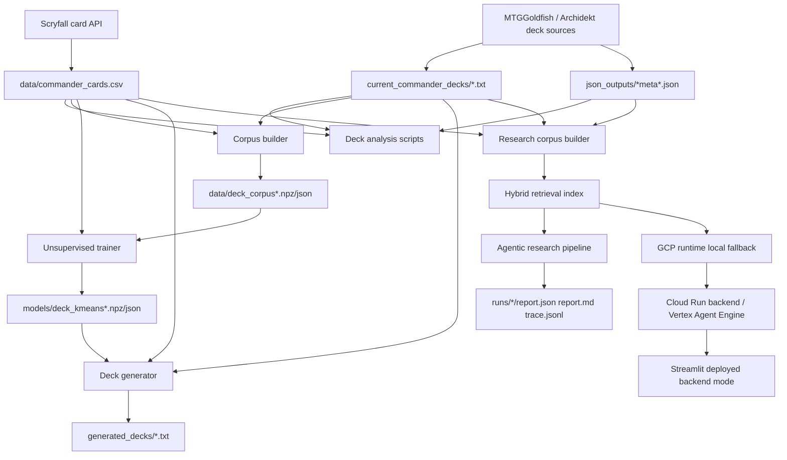

The repository is Python-first. There is no `pyproject.toml`; dependency groups are split across requirements files:

- `requirements.txt`: core runtime, ML, scraping, LangGraph.
- `requirements-ui.txt`: minimal local Streamlit UI dependencies.
- `requirements-gcp.txt`: Cloud Run, ADK, Vertex, FastAPI, GCS dependencies.
- `requirements-dev.txt`: test dependencies.

---

## 2. Domain Primer: Magic Terms Used Everywhere

If you are not deeply familiar with Magic: The Gathering, these concepts explain most of the project vocabulary.

| Term | Meaning in this repo |
|---|---|
| Card database | A CSV where each row represents a card and derived features such as type, colors, color identity, oracle text, and booleans like `is_land`. |
| Oracle text | The official rules text printed for a card. The repo uses it for mechanic detection, semantic embeddings, retrieval chunks, and LLM context. |
| Decklist | A text list of cards, usually with counts like `1 Sol Ring`. Commander lists may include sections such as `Commander`, `Deck`, `Companion`, and `Sideboard`. |
| Commander | A singleton 100-card MTG format where one or more commander cards determine legal color identity. |
| Command zone | The decklist section containing commander and companion cards. In this repo, command-zone cards can be included in training and analysis context. |
| Color identity | The set of MTG colors a card belongs to for deck legality: `W`, `U`, `B`, `R`, `G`. Commander decks can only include cards inside their commander's color identity. |
| CMC / mana value | Converted mana cost, now commonly called mana value. The repo uses `cmc` for mana curve statistics. |
| Mana curve | Distribution of cards by mana value. Used to infer speed and archetype. |
| Archetype | Strategy label such as aggro, midrange, control, tempo, combo, or hybrid. |
| Meta / metagame | The observed environment of popular or successful decks. The repo scrapes and analyzes meta decklists. |
| Ramp | Cards that accelerate mana production. The repo detects ramp sources heuristically. |
| Interaction | Cards that answer threats, such as removal, counterspells, tapping, exile, or damage effects. |
| Card advantage | Cards or effects that produce extra cards, selection, recursion, or resources. |
| Singleton rule | Commander normally permits only one copy of each non-basic card, with some explicit exceptions. |

Important card data convention:

- Split or dual-faced names may be normalized from `Fire / Ice` to `Fire // Ice`.
- `name` usually stores the front-face name.
- `full_name` stores the full card name when available.

---

## 3. AI and ML Primer: Concepts Used in the Repo

The repo mixes classical ML, information retrieval, LLM calls, and deterministic fallbacks.

| Concept | Repo meaning |
|---|---|
| RAG | Retrieval-Augmented Generation. The system first retrieves relevant chunks from local card/deck/meta data, then writes an answer using that evidence. |
| Corpus | A collection of searchable documents. Here, the corpus is built from decklists, card database rows, and meta JSON records. |
| Chunk | A small document segment. The repo represents chunks with `DocumentChunk` and retrieved chunks with `RetrievedChunk`. |
| Lexical retrieval | Keyword-based retrieval using TF-IDF and cosine similarity. Implemented in `HybridRetrievalIndex`. |
| Semantic retrieval | Meaning-based retrieval using sentence-transformer embeddings when available. It is optional and falls back gracefully. |
| TF-IDF | Term Frequency-Inverse Document Frequency. It turns text into sparse vectors that highlight important words. Used in retrieval and card text embedding training. |
| Cosine similarity | A vector similarity metric. Used to compare query vectors to document vectors. |
| Embedding | A numeric vector representation of text. Used for semantic search and card oracle-text semantics. |
| SVD | Singular Value Decomposition. `TruncatedSVD` compresses high-dimensional TF-IDF vectors into dense card text vectors. |
| KMeans | Clustering algorithm. Here it groups deck vectors into archetype-like clusters. |
| MiniBatchKMeans | A scalable KMeans variant used by `train_deck_generator.py`. |
| Agent | A component with a responsibility, such as planning, retrieval, reranking, criticism, deck planning, or safety. Some agents are deterministic Python classes, while ADK deployment wraps them in LLM agent definitions. |
| LangGraph | Optional graph runtime for the research pipeline state machine. If unavailable or disabled, a manual loop performs the same node order. |
| ADK | Google Agent Development Kit. Used in `gcp_agent_runtime/adk_app.py` to define deployable agents and a tool. |
| Vertex AI Agent Engine | GCP target for deploying the ADK app. |
| Groundedness | In this repo, the fraction of claims with valid citations and lexical support above a threshold. |
| Faithfulness | In this repo, the mean lexical overlap between claims and cited evidence. |
| Citation precision | Fraction of citations that point to retrieved chunks. |
| Release gate | An automated pass/fail check over eval metrics before promoting a runtime. |

The repo intentionally supports no-key usage. If `OPENAI_API_KEY` is absent, local synthesis uses deterministic rule-based logic. That makes the project testable offline.

---

## 4. Repository Map

```text
.
|-- README.md
|-- requirements*.txt
|-- Dockerfile.ui
|-- Dockerfile.backend
|-- docker-compose.yml
|-- mtg_io.py
|-- fetch_standard_legal_cards.py
|-- current_standard_deck_list_scraper.py
|-- archidekt_deck_list_scraper.py
|-- deck_analysis.py
|-- ai_deck_generator.py
|-- deck_corpus_builder.py
|-- train_deck_generator.py
|-- research_pipeline/
|-- gcp_agent_runtime/
|-- mtg_ui_app/
|-- eval/
|-- tests/
|-- docs/
|-- infra/gcp/
|-- data/
|-- current_commander_decks/
|-- json_outputs/
|-- models/
|-- runs/
|-- generated_decks/
```

Major directories:

| Path | Role |
|---|---|
| `data/` | Local card CSV and sparse deck corpus artifacts. |
| `current_commander_decks/` | Local decklist text files, currently hundreds of Commander decks. |
| `json_outputs/` | Meta-analysis and scraper JSON outputs. |
| `models/` | Trained KMeans cluster model artifacts. |
| `generated_decks/` | Example generated decklists. |
| `research_pipeline/` | Local agentic RAG research pipeline. |
| `gcp_agent_runtime/` | Production-style GCP runtime contracts, coordinator, agents, ADK app, and adapter. |
| `mtg_ui_app/` | Streamlit tab implementations. |
| `eval/` | Top-level eval dataset and GCP release/fanout helpers. |
| `tests/` | Unit and integration tests covering parsers, generation, retrieval, evals, and GCP runtime. |
| `infra/gcp/` | Operational notes and policy templates. |
| `docs/` | Project documentation, including this report. |

---

## 5. Canonical Data Artifacts

The repo uses local artifacts rather than a database server.

### 5.1 Card CSV

`data/commander_cards.csv` is the main card database. It is produced by `fetch_standard_legal_cards.py` from Scryfall.

Typical columns:

```text
name, full_name, layout, mana_cost, cmc, type_line, oracle_text,
colors, color_identity, power, toughness, rarity, set, collector_number,
keywords, produced_mana, legalities, is_creature, is_land,
is_instant_sorcery, is_multicolored, color_count, has_etb_effect,
is_legendary
```

The current local CSV contains about 30k card rows. The exact count changes when Scryfall data changes and when the CSV is regenerated.

### 5.2 Decklists

`current_commander_decks/` stores text decklists. Commander format is usually:

```text
Commander
1 Atraxa, Praetors' Voice

Deck
1 Sol Ring
1 Arcane Signet
...
```

Constructed format can use a blank line to split mainboard and sideboard.

### 5.3 Meta JSON

`json_outputs/` stores outputs from scrapers and analysis scripts. Examples:

- `commander_meta_representation.json`: Archidekt-derived Commander meta records.
- `deck_meta_representation.json`: MTGGoldfish-style Standard meta records.
- `parse_meta_analysis_results.json`: rule/pattern analysis output.
- `meta_keyword_analysis_results.json`: statistical keyword/type analysis output.
- `enhanced_semantic_meta_analysis.json`: semantic plus deck-name analysis output.
- `consolidated_meta_report.json`: combined report generated from multiple methods.

### 5.4 Corpus and Model Files

`deck_corpus_builder.py` writes:

- `<prefix>.npz`: sparse deck-by-card matrix data.
- `<prefix>_cards.json`: ordered card vocabulary.
- `<prefix>_meta.json`: quality statistics and build metadata.

`train_deck_generator.py` writes:

- `<prefix>.npz`: cluster centers, cluster color profiles, optional card text embeddings, optional cluster semantic centers.
- `<prefix>_meta.json`: card vocabulary, cluster sizes, inertia, semantic metadata.

The existing full model metadata indicates a 16-cluster model over a 7,944-card vocabulary with semantic card-text weighting enabled.

---

## 6. Shared I/O Layer: `mtg_io.py`

`mtg_io.py` is foundational. Many modules rely on it for consistent parsing.

### 6.1 Why It Matters

Without shared parsing, the repository would produce inconsistent results. A card could be counted in one script and missed in another because of a formatting difference. `mtg_io.py` centralizes common conversions.

### 6.2 Key Functions

| Function | Purpose |
|---|---|
| `normalize_card_name(card_name)` | Converts single slash split-card notation to double slash notation. |
| `safe_parse_list(value)` | Converts CSV string fields like `['W', 'U']` into Python lists. |
| `parse_decklist_lines(lines)` | Parses count-prefixed deck lines into `mainboard`, `sideboard`, `commanders`, and `companions`. |
| `parse_decklist_file(filepath)` | Reads a decklist file and delegates to `parse_decklist_lines`. |
| `load_decklists_from_directory(directory, include_command_zone=True)` | Loads all `.txt` decklists from a directory. |
| `load_card_database(csv_path)` | Loads the card CSV and coerces booleans, lists, and numeric columns. |

### 6.3 Decklist Parsing Rules

`parse_decklist_lines` supports two formats:

1. Explicit section headers:

```text
Commander
1 Commander Name

Deck
1 Sol Ring
```

2. Blank-line sideboard split:

```text
4 Mainboard Card
2 Another Mainboard Card

1 Sideboard Card
```

The parser returns:

```python
{
    "mainboard": [...],
    "sideboard": [...],
    "commanders": [...],
    "companions": [...],
}
```

Card counts are expanded into repeated card names. For example, `4 Lightning Bolt` becomes four entries in the section list.

---

## 7. Data Ingestion

There are three main ingestion paths.

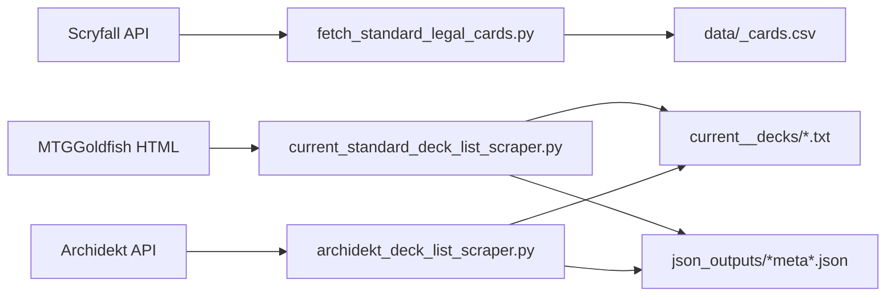

### 7.1 Scryfall Fetcher: `fetch_standard_legal_cards.py`

`ScryfallFetcher` fetches format-legal cards from Scryfall, handles pagination, rate limits requests, and writes a structured CSV.

Supported default formats:

- `commander`: query `format:commander legal:commander`
- `standard`: query `format:standard legal:standard`

Important implementation details:

- `_make_request` sleeps briefly before calls and retries on HTTP 429.
- `get_cards_for_format` follows Scryfall pagination via `has_more` and `next_page`.
- `process_card_data` handles normal cards and multi-face layouts such as split, adventure, modal DFC, and transform.
- Room cards receive special combined oracle text when both faces are Room types.
- Derived booleans such as `is_creature`, `is_land`, `is_multicolored`, and `is_legendary` are added.

Command:

```bash
python fetch_standard_legal_cards.py --format commander
```

### 7.2 MTGGoldfish Scraper: `current_standard_deck_list_scraper.py`

Despite the filename, this scraper supports format configuration and defaults to Commander in docs.

Key flow:

1. Fetch metagame page.
2. Parse archetype tiles with BeautifulSoup.
3. Filter by minimum meta percentage.
4. Visit each archetype page.
5. Find the download link.
6. Save a formatted decklist file.
7. Export meta records to `json_outputs/`.

It is HTML-scraping based, so it can break if MTGGoldfish changes page structure.

### 7.3 Archidekt Scraper: `archidekt_deck_list_scraper.py`

This is a newer alternative source that uses Archidekt API endpoints.

Important behavior:

- Collects recent deck summaries by format.
- Computes a synthetic meta percentage from view count and recency.
- Downloads deck details from `/decks/<id>/`.
- Extracts cards into `commanders`, `companions`, `mainboard`, and `sideboard`.
- Skips maybeboard, token, and emblem entries.
- Applies format-aware size filters, such as 95 to 120 total cards for Commander.
- Rejects Commander decks without a Commander section.
- Writes decklists with stable section formatting.
- Exports metadata to `json_outputs/commander_meta_representation.json` or a format-specific file.

This scraper is covered by tests for section extraction, deck formatting, meta percentage ranking, and Commander-size validation.

---

## 8. Deck Analysis: `deck_analysis.py`

`deck_analysis.py` analyzes a single decklist against the card database.

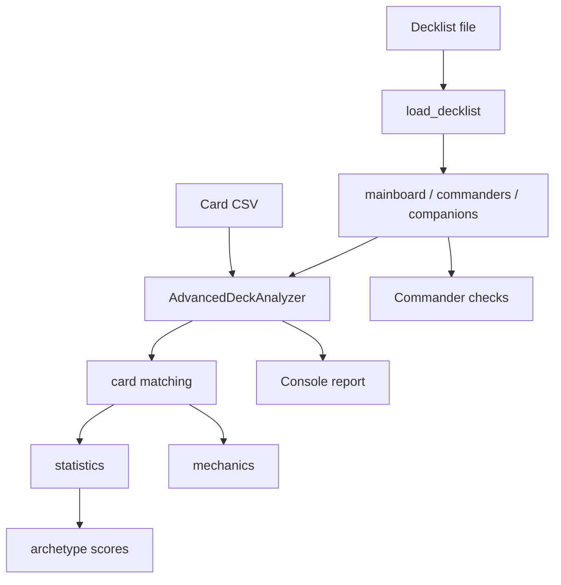

### 8.1 `DeckArchetype`

`DeckArchetype` is an enum:

- `AGGRO`
- `MIDRANGE`
- `CONTROL`
- `TEMPO`
- `COMBO`
- `HYBRID`
- `UNKNOWN`

`get_characteristics` defines rough statistical ranges per archetype. For example:

- Aggro: higher creature ratio, lower average CMC, early curve peak.
- Control: higher removal/interaction/card-advantage ratios, higher average CMC.
- Tempo: balanced creatures plus interaction.

These are heuristic, not learned labels.

### 8.2 `AdvancedDeckAnalyzer`

Important responsibilities:

| Method | Role |
|---|---|
| `analyze_deck` | Orchestrates matching, statistics, mechanics, archetype detection, and Commander profile. |
| `_match_cards_in_database` | Matches deck names against `name` and `full_name`, including split-card variants. |
| `_calculate_deck_statistics` | Computes land ratio, creature ratio, average CMC, median CMC, color diversity, mana curve, and advanced ratios. |
| `_calculate_advanced_ratios` | Detects interaction, removal, and card advantage from oracle-text regexes. |
| `_extract_card_mechanics` | Detects card mechanics from type, keywords, oracle text, and Room-specific logic. |
| `_detect_archetype` | Scores archetype fits against heuristic characteristic ranges. |
| `_analyze_commander_profile` | Checks Commander-specific legality and ramp density heuristics. |

### 8.3 Commander Legality Checks

Commander profile includes:

- whether commanders are present,
- expected mainboard size,
- size legality,
- missing commanders from database,
- inferred commander color identity,
- color identity violations,
- singleton violations,
- ramp source count and ramp ratio.

Singleton exceptions include:

- `Relentless Rats`
- `Rat Colony`
- `Shadowborn Apostle`
- `Persistent Petitioners`
- `Dragon's Approach`

Basic lands are also allowed in multiples.

Command:

```bash
python deck_analysis.py current_commander_decks/some_deck.txt --cards data/commander_cards.csv
```

---

## 9. Meta Analysis

Legacy standalone meta analyzer scripts were retired. The supported analysis surface is now:

- `deck_analysis.py` for per-deck archetype and legality analysis.
- `research_pipeline/` for retrieval-grounded, citation-backed meta and strategy research.

Recommended workflow:

1. Refresh card/deck data (`fetch_standard_legal_cards.py`, scraper scripts).
2. Run `deck_analysis.py` for targeted deck diagnostics.
3. Run `run_research_pipeline.py` for broader meta questions with grounded evidence.

---

## 10. Deck Corpus Builder: `deck_corpus_builder.py`

The deck corpus builder turns decklists into a machine-learning matrix.

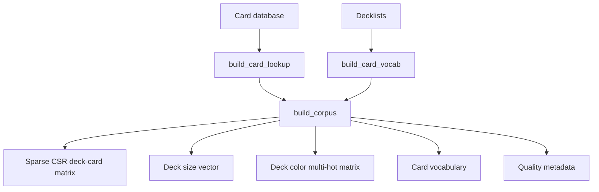

### 10.1 What Matrix Is Built?

The core artifact is a deck-by-card count matrix `X`.

- Rows: decks.
- Columns: cards in the vocabulary.
- Values: number of copies of that card in that deck.

The matrix is saved in compressed sparse row format. Sparse format matters because most decks contain a tiny subset of all known cards.

### 10.2 Key Functions

| Function | Role |
|---|---|
| `build_card_vocab` | Counts known cards appearing in decklists and applies frequency/vocab filters. |
| `build_card_lookup` | Creates compact card metadata lookup by card name. |
| `compute_deck_colors` | Builds a 5-dimensional color-identity multi-hot vector for a deck. |
| `build_corpus` | Produces the matrix and quality statistics. |

### 10.3 Quality Stats

Metadata records:

- matched cards in DB,
- unknown cards,
- unique known cards seen,
- vocab size after filters,
- coverage ratio,
- deck size min/max/mean,
- matrix nonzero entries,
- matrix density.

These numbers matter because they tell you whether training is meaningful. Low coverage means the card database and decklists do not align.

Command:

```bash
python deck_corpus_builder.py \
  --cards data/commander_cards.csv \
  --decks current_commander_decks \
  --output-prefix data/deck_corpus \
  --min-card-frequency 2
```

---

## 11. Unsupervised Trainer: `train_deck_generator.py`

The trainer learns deck clusters from the corpus.

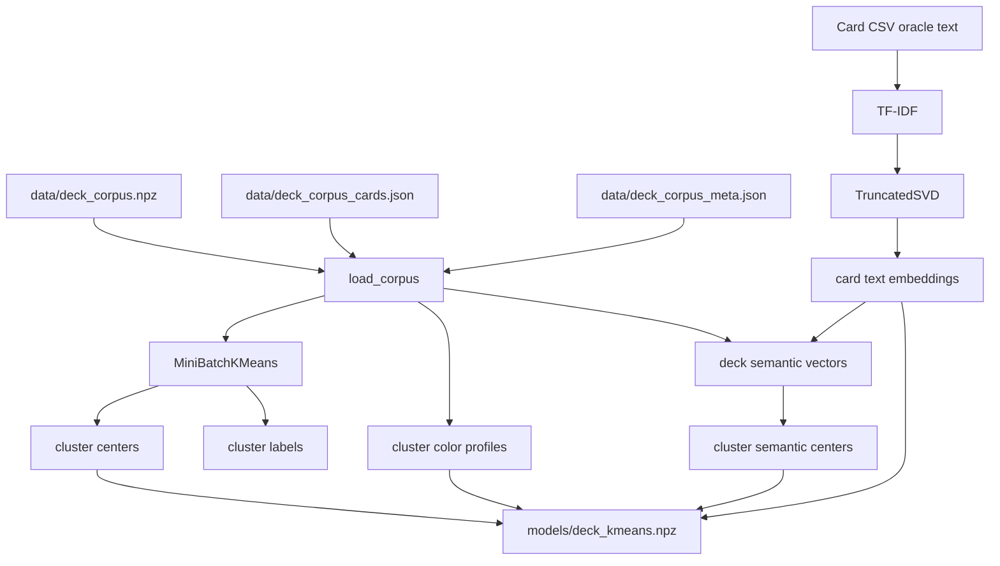

### 11.1 Main Model Components

| Artifact | Meaning |
|---|---|
| `cluster_centers` | Average card-count profile per cluster. High values mean cards typical of that cluster. |
| `cluster_colors` | Average color identity vector of decks in each cluster. Used to select a cluster matching requested colors. |
| `card_text_embeddings` | Optional dense semantic vectors derived from card names and oracle text. |
| `cluster_semantic_centers` | Optional average semantic vector per cluster. Used to boost semantically aligned cards. |

### 11.2 Why KMeans?

KMeans groups decks with similar card composition. In this repo it is used as a lightweight unsupervised approximation of deck archetypes. It does not need labels like `aggro` or `control`.

### 11.3 Why TF-IDF + SVD?

Card oracle text is high-dimensional text. TF-IDF captures important terms; SVD compresses them into dense vectors. These vectors give the generator a way to prefer cards whose rules text resembles the chosen deck cluster.

Command:

```bash
python train_deck_generator.py \
  --corpus-prefix data/deck_corpus \
  --cards data/commander_cards.csv \
  --semantic-dim 64 \
  --clusters 16 \
  --output-prefix models/deck_kmeans
```

---

## 12. Deck Generator: `ai_deck_generator.py`

The deck generator is a baseline, explainable, meta-driven generator.

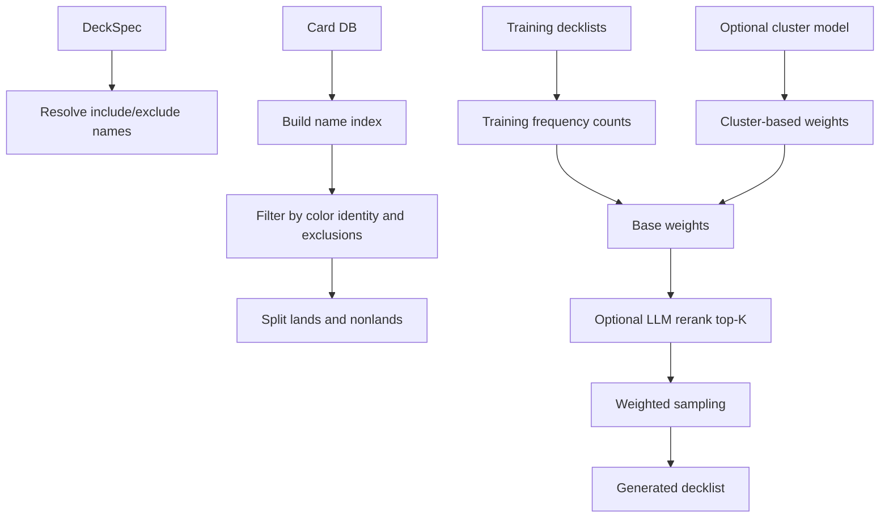

### 12.1 `DeckSpec`

`DeckSpec` is the generator's high-level input contract.

Fields:

- `format`: usually `commander`.
- `colors`: list such as `['W', 'R']`.
- `archetype`: optional hint.
- `target_size`: optional deck size override.
- `land_ratio`: optional land ratio override.
- `include_cards`: cards that should be included.
- `exclude_cards`: cards that must not be included.

Format-aware defaults:

- Commander target size: 100.
- Other constructed target size: 60.
- Commander land ratio: 0.42.
- Other formats land ratio: 0.40.

### 12.2 Name Resolution

The generator has robust include/exclude card name handling:

- exact case-insensitive match,
- punctuation-insensitive match,
- full-name match,
- adjacent-token merging when comma-separated names get split incorrectly.

Example: `Lathril Blade of the Elves` can resolve to `Lathril, Blade of the Elves`.

### 12.3 Color and Copy Rules

`card_matches_colors` allows cards if:

- no requested colors were provided,
- the card is colorless,
- or the card's color identity is a subset of requested colors.

`max_allowed_copies` approximates format legality:

- Commander: one copy unless basic land or explicit duplicate exception.
- Non-Commander: four copies unless basic land.

### 12.4 Weighting Formula

Without a cluster model, each card gets a base weight:

```text
weight = training_count(card) + 1
```

The `+ 1` means unseen cards still have nonzero probability.

With a cluster model:

```text
weight = base_frequency
       * (1 + cluster_strength * cluster_norm)
       * (1 + semantic_strength * semantic_boost)
```

Where:

- `cluster_norm` is how typical the card is in the selected cluster.
- `semantic_boost` is cosine similarity between card text embedding and cluster semantic center.

### 12.5 Optional LLM Rerank

`LLMRerankConfig` enables a bounded-cost LLM reranking step. It only reranks the top-K candidates per category, not the full card universe.

The LLM is asked to return strict JSON:

```json
{"scores": {"Card Name": 87}}
```

The scores multiplicatively boost candidate weights. If the request fails or no API key is present, the generator falls back to non-LLM weights.

### 12.6 Sampling Process

1. Load card database and training decklists.
2. Resolve includes/excludes.
3. Filter by color identity.
4. Split allowed cards into lands and spells.
5. Build weights.
6. Include required cards first.
7. Fill lands up to land target.
8. Fill remaining slots with spells.
9. Enforce copy limits during sampling.
10. Format decklist by count, nonlands first and lands last.

Command:

```bash
python ai_deck_generator.py \
  --cards data/commander_cards.csv \
  --training-decks current_commander_decks \
  --cluster-model models/deck_kmeans \
  --format commander \
  --colors WR \
  --size 100 \
  --semantic-strength 1.0 \
  --output generated_decks/boros_commander_ai.txt
```

---

## 13. Local Research Pipeline: `research_pipeline/`

This is the main agentic RAG system.

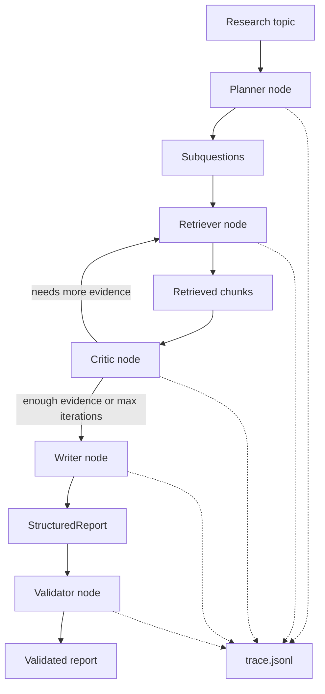

### 13.1 Core Data Models: `research_pipeline/models.py`

| Dataclass | Meaning |
|---|---|
| `DocumentChunk` | A searchable source chunk before retrieval. |
| `RetrievedChunk` | A chunk returned by retrieval with a score. |
| `Citation` | A citation pointer containing `doc_id` and `chunk_id`. |
| `Claim` | One report claim, its citations, and confidence. |
| `StructuredReport` | Final report with topic, summary, claims, open questions, and validation. |

These models all provide serialization helpers such as `to_dict` and `from_dict`. That is important because reports, state, traces, and eval artifacts are JSON-friendly.

### 13.2 Corpus Builder: `research_pipeline/retrieval/corpus.py`

The RAG corpus is built from three source types:

1. Decklists from `current_commander_decks/`.
2. Card rows from `data/commander_cards.csv`.
3. Meta JSON records from `json_outputs/*.json` or user-provided paths.

Each source becomes `DocumentChunk` objects.

Deck chunks look like:

```text
Deck <deck name>. Total cards: <n>. Most frequent cards: ... Deck card sequence: ...
```

Card chunks look like:

```text
Card <name>. Type: <type_line>. Mana cost: <mana_cost>. Color identity: ...
Keywords: ... Set code: ... Set name: ... Oracle text: ...
```

Meta chunks look like:

```text
Archetype <name>. Meta percentage: <x>. Deck count: <n>. URL: <url>.
```

### 13.3 Hybrid Retrieval Index: `research_pipeline/retrieval/index.py`

`HybridRetrievalIndex` combines:

- TF-IDF lexical scores,
- optional sentence-transformer semantic scores,
- configurable lexical and semantic weights.

If sentence-transformers fail to import or the model cannot load, semantic retrieval is disabled and lexical retrieval still works.

Score combination:

```text
combined = (lexical_weight * normalized_lexical
          + semantic_weight * normalized_semantic)
          / (lexical_weight + semantic_weight)
```

If semantic scores are absent, only lexical scores are used.

### 13.4 LLM Abstraction: `research_pipeline/llm.py`

`AgentLLM` defines three abstract methods:

- `plan_subquestions`
- `critique`
- `write_report`

There are two implementations:

| Class | Behavior |
|---|---|
| `RuleBasedLLM` | Deterministic fallback for offline/test use. Generates generic subquestions, checks token coverage, and writes claims from top chunks. |
| `OpenAIChatLLM` | Calls an OpenAI-compatible chat completions endpoint and expects JSON outputs. Falls back to `RuleBasedLLM` on errors. |

`build_default_llm` chooses `OpenAIChatLLM` only when the configured API key env var exists. Otherwise it returns `RuleBasedLLM`.

### 13.5 Pipeline State: `research_pipeline/graph.py`

The `PipelineState` typed dictionary carries:

- `topic`
- `iteration`
- `max_iterations`
- `subquestions`
- `active_queries`
- `retrieved_chunks`
- `query_hits`
- `gaps`
- `critic_reason`
- `critic_needs_more_research`
- `report`

`ResearchPipeline.run(topic)` initializes this state, executes a LangGraph graph if available, otherwise runs a manual loop.

### 13.6 Nodes

| Node | File | Responsibility |
|---|---|---|
| Planner | `nodes/planner.py` | Converts the topic and prior gaps into subquestions. |
| Retriever | `nodes/retriever.py` | Runs each active query, merges and deduplicates chunks, and stores query hits. |
| Critic | `nodes/critic.py` | Decides if evidence is thin and creates gap queries for another retrieval pass. |
| Writer | `nodes/writer.py` | Produces a `StructuredReport` from retrieved chunks. |
| Validator | `nodes/validator.py` | Scores citations and support using lexical overlap. |

### 13.7 Validation

Validation is implemented in `research_pipeline/validation.py` and `research_pipeline/grounding.py`.

For each claim:

1. Gather cited retrieved chunks.
2. Compute lexical overlap between claim and cited evidence.
3. Mark the claim supported if it has at least one valid citation and overlap >= `DEFAULT_SUPPORT_THRESHOLD`.

Metrics:

| Metric | Calculation |
|---|---|
| `groundedness` | supported claims / total claims |
| `faithfulness` | mean claim-evidence lexical overlap |
| `citation_precision` | valid citations / total citations |
| `citation_recall` | same as groundedness in current implementation |

This is intentionally lightweight. It is not a semantic judge; it is an offline deterministic signal.

### 13.8 Trace Logging

`TraceLogger` writes JSONL rows to `trace.jsonl`:

- `pipeline_start`
- `pipeline_end`
- `node_start`
- `node_end`

Payloads are truncated to keep traces manageable.

Run command:

```bash
python run_research_pipeline.py \
  "What card advantage patterns appear most often in successful Boros commander decks?" \
  --cards data/commander_cards.csv \
  --decks current_commander_decks
```

Artifacts:

```text
runs/<timestamp>/report.json
runs/<timestamp>/report.md
runs/<timestamp>/state.json
runs/<timestamp>/trace.jsonl
```

---

## 14. Eval Harness

There are two eval layers:

1. Local research pipeline eval under `research_pipeline/eval/`.
2. Top-level Vertex-style release gate under `eval/`.

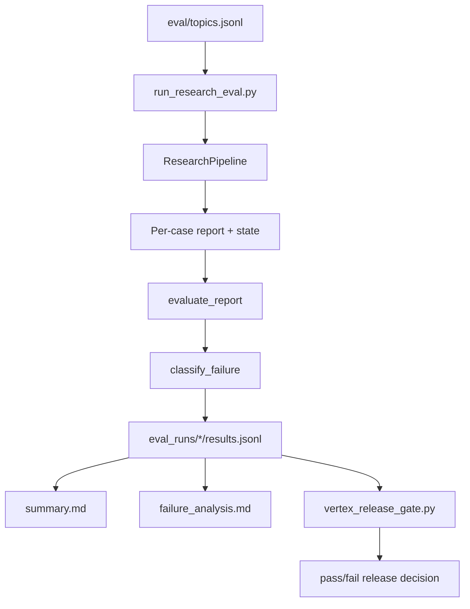

### 14.1 Dataset

`eval/topics.jsonl` contains 24 research prompts. Each row has:

- `id`
- `topic`
- `category`
- `difficulty`

Categories include ramp, interaction, card advantage, mana base, resilience, archetype, composition, consistency, and synergy.

### 14.2 Local Eval Runner

`research_pipeline/eval/run_eval.py` does this:

1. Load cases.
2. Build one local research pipeline.
3. Run every topic through the pipeline.
4. Validate each report against retrieved chunks.
5. Classify failure type.
6. Write artifacts.

Failure taxonomy:

| Failure | Trigger |
|---|---|
| `retrieval_miss` | No claims or groundedness below threshold. |
| `bad_citation` | Missing citations or low citation precision. |
| `hallucinated_claim` | Very low faithfulness. |
| `ok` | No rule triggered. |

Run command:

```bash
python run_research_eval.py \
  --dataset eval/topics.jsonl \
  --cards data/commander_cards.csv \
  --decks current_commander_decks
```

### 14.3 Vertex-Style Release Gate

`eval/vertex_release_gate.py` loads `results.jsonl` and checks aggregate thresholds.

Default thresholds:

- mean groundedness >= 0.65
- mean faithfulness >= 0.20
- mean citation precision >= 0.70

If the gate fails, the script exits with code `2`.

Run command:

```bash
python eval/vertex_release_gate.py --results eval_runs/<timestamp>/results.jsonl
```

### 14.4 LangSmith Fanout Helper

`eval/langsmith_fanout.py` prints environment variables for LangSmith OpenTelemetry fanout:

- `LANGSMITH_OTEL_ENABLED`
- `LANGSMITH_API_KEY`
- `LANGSMITH_PROJECT`
- `OTEL_EXPORTER_OTLP_ENDPOINT`
- `OTEL_EXPORTER_OTLP_HEADERS`

It does not send traces itself; it generates env configuration.

---

## 15. Streamlit UI: `mtg_ui.py` and `mtg_ui_app/`

The Streamlit app exposes four workflows.

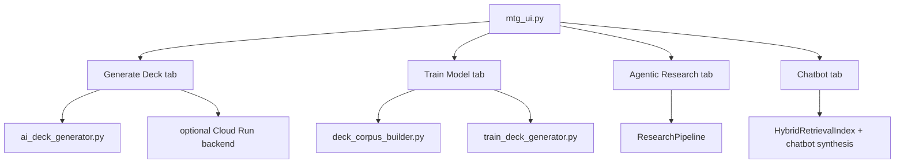

### 15.1 Entry Point: `mtg_ui.py`

The app configures the page and renders tabs:

- `Generate Deck`
- `Train Model`
- `Agentic Research`
- `Chatbot`

### 15.2 Shared UI Helpers: `mtg_ui_app/shared.py`

Important functions:

| Function | Role |
|---|---|
| `cached_load_card_db` | Streamlit-cached card CSV loading. |
| `cached_load_decklists` | Streamlit-cached decklist loading. |
| `cached_load_cluster_model` | Streamlit-cached cluster model loading. |
| `cached_build_research_index` | Streamlit-cached RAG index construction. |
| `run_cli_command` | Runs builder/trainer CLIs from UI. |
| `call_deployed_recommendation` | Calls the Cloud Run backend contract. |
| `generate_chatbot_answer` | Retrieves evidence and synthesizes chat answer with optional LLM. |
| `save_agentic_run_artifacts` | Writes report/state/markdown artifacts. |

### 15.3 Generate Deck Tab

`mtg_ui_app/generate_tab.py` lets users configure:

- card CSV path,
- deck directory,
- cluster model prefix,
- deployed backend mode,
- deck format,
- colors,
- archetype hint,
- target size,
- land ratio,
- include/exclude cards,
- cluster strength,
- semantic strength,
- optional LLM reranking.

Two execution modes:

1. Local generation through `generate_deck_from_meta`.
2. Deployed backend call through `/v1/deck/recommend`, with local fallback if backend fails.

### 15.4 Train Model Tab

`mtg_ui_app/train_tab.py` wraps:

- `deck_corpus_builder.py`
- `train_deck_generator.py`

It validates paths, runs commands with `sys.executable`, displays stdout/stderr, and shows generated metadata JSON.

### 15.5 Agentic Research Tab

`mtg_ui_app/agentic_tab.py` builds a retrieval index, constructs a `ResearchPipeline`, runs a topic, displays the summary/claims/open questions/validation, and optionally saves artifacts to `runs/`.

### 15.6 Chatbot Tab

`mtg_ui_app/chat_tab.py` supports retrieval-grounded Q&A over local corpus data.

The chatbot:

- builds the same hybrid retrieval index,
- detects set names/codes from user text,
- boosts explicitly mentioned cards into evidence,
- optionally calls OpenAI-compatible chat completions,
- falls back to `RuleBasedLLM`,
- stores chat history in Streamlit session state,
- shows evidence in expandable sections.

---

## 16. GCP Runtime: `gcp_agent_runtime/`

The GCP runtime is a production-style deck recommendation layer. It is separate from the local research pipeline but reuses some local retrieval and generation utilities.

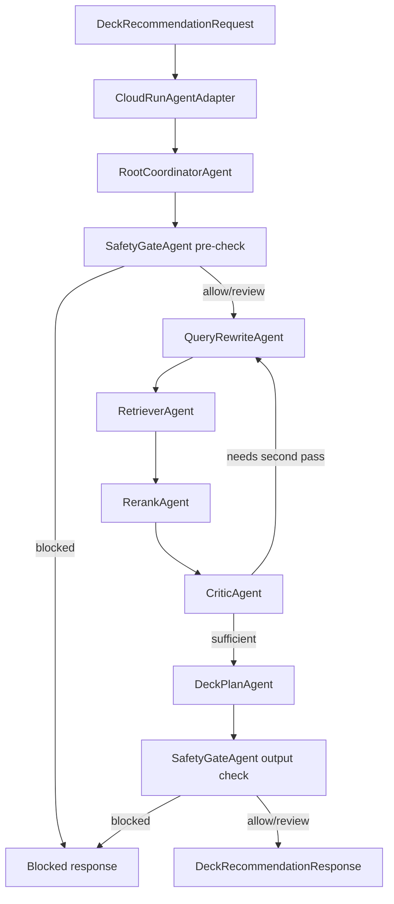

### 16.1 Contracts: `contracts.py`

The runtime uses explicit dataclass contracts.

| Contract | Purpose |
|---|---|
| `DeckRecommendationRequest` | API request shape. Validates session, query, and mode. |
| `RetrievalPlan` | Query rewrites, target corpora, metadata filters, top-K, max chunks. |
| `RetrievedEvidence` | Runtime evidence chunk shape. |
| `RetrievalBundle` | Retrieval plan plus chunks, rerank scores, provenance. |
| `DeckCitation` | Citation shape returned to API clients. |
| `SafetyVerdict` | Safety status, reasons, risk score, blocked flag. |
| `DeckRecommendationResponse` | API response shape with summary, decklist, claims, citations, confidence, safety, trace, latency, model. |

Allowed request modes:

- `deck_recommendation`
- `research_copilot`

### 16.2 Cloud Run Adapter: `adapter.py`

`CloudRunAgentAdapter` converts raw JSON into `DeckRecommendationRequest`, calls the coordinator, and serializes the response.

`create_fastapi_app` exposes:

- `GET /healthz`
- `POST /v1/deck/recommend`

`run_backend_adapter.py` runs the FastAPI app with uvicorn.

### 16.3 Coordinator: `coordinator.py`

`RootCoordinatorAgent` controls the runtime sequence:

1. Generate a trace ID.
2. Run input safety gate.
3. Build retrieval plan.
4. Retrieve evidence.
5. Rerank evidence.
6. Critique coverage.
7. Optionally perform a second retrieval pass.
8. Generate a deck plan.
9. Run output safety gate.
10. Return a response with latency and model used.

The coordinator uses dependency injection, which makes it easy to test with fake retrievers or stub deck planners.

### 16.4 Query Rewrite Agent: `query_rewrite.py`

`QueryRewriteAgent` creates deterministic retrieval variants from the user request:

- base user query,
- color identity query,
- archetype query,
- include-card query,
- keyword-only query,
- extra gap queries from the critic.

The output is a `RetrievalPlan` targeting `decklist`, `card_db`, and `meta_json`.

### 16.5 Retrieval Agent: `retrieval.py`

There are two retriever clients:

| Client | Use |
|---|---|
| `LocalHybridRetrieverClient` | Local fallback using `build_domain_corpus` and `HybridRetrievalIndex`. |
| `VertexRagRetrieverClient` | Managed Vertex RAG Engine client when Vertex SDK and RAG corpora are configured. |

`RetrieverAgent` wraps a client and returns a `RetrievalBundle` with provenance.

### 16.6 Rerank Agent: `rerank.py`

`RerankAgent` computes a new score from:

- original retrieval score,
- token overlap with user query,
- source prior.

Default source priors:

- `decklist`: 1.0
- `card_db`: 0.95
- `meta_json`: 0.9
- `vertex_rag`: 1.0

It keeps only `top_n`, default 12.

### 16.7 Critic Agent: `critic.py`

`CriticAgent` checks if retrieval coverage is sufficient.

Signals:

- unique document count,
- chunk count,
- whether required include cards appear in evidence.

It returns:

- `needs_second_pass`,
- gap queries,
- reason,
- predicted confidence.

### 16.8 Deck Plan Agent: `deck_plan.py`

`DeckPlanAgent` does three things:

1. Chooses model path through `ModelLifecycleGuard`.
2. Calls the local `generate_deck_from_meta` generator.
3. Builds key claims and citations from top evidence chunks.

It caches the card database and decklists after first load.

Important limitation:

- The current implementation records the selected Gemini model in metadata but does not actually call Gemini for generation. Deck generation is still local/deterministic. The ADK wrapper defines LLM agents, but the concrete local coordinator uses Python components.

### 16.9 Safety Gate: `safety.py`

`SafetyGateAgent` blocks unsupported modes and prompt-injection/security patterns such as:

- ignore previous instructions,
- disable safety,
- bypass guardrails,
- jailbreak,
- prompt injection,
- exfiltration,
- malware,
- phishing,
- `drop table`,
- `sudo rm -rf`.

It can also flag review warnings for terms like API key, credential, private data, or secret.

### 16.10 Model Routing: `model_routing.py`

`ModelLifecycleGuard` chooses between:

- default: `gemini-2.5-flash`
- escalation: `gemini-2.5-pro`
- fallback: `gemini-2.5-flash`

Escalation happens when:

- complexity score >= 0.65, or
- predicted confidence <= 0.45.

Lifecycle guard:

- A model EOL date can force fallback.
- Default EOL map includes `gemini-2.5-pro: 2026-06-17`.
- Env var override format: `MODEL_EOL_GEMINI_2_5_PRO=YYYY-MM-DD`.

### 16.11 ADK App: `adk_app.py`

`build_adk_root_agent` defines a deployable ADK `LlmAgent` tree:

- RootCoordinatorAgent
- QueryRewriteAgent
- RetrieverAgent
- RerankAgent
- CriticAgent
- DeckPlanAgent
- SafetyGateAgent

It registers one function tool, `run_deck_recommendation`, which calls `CloudRunAgentAdapter.handle_request`.

`build_agent_engine_app` wraps the ADK root agent in `vertexai.agent_engines.AdkApp` with tracing enabled.

---

## 17. GCP Deployment and Operations

### 17.1 Docker Compose

`docker-compose.yml` runs two services:

- `mtg-backend`: FastAPI backend adapter on port 8080.
- `mtg-ui`: Streamlit UI on port 8501.

The UI points to the backend endpoint via `MTG_GCP_BACKEND_URL`.

Command:

```bash
docker compose up --build
```

### 17.2 Backend Dockerfile

`Dockerfile.backend`:

- uses `python:3.11-slim`,
- installs `requirements-gcp.txt`,
- runs `python run_backend_adapter.py`,
- exposes 8080.

### 17.3 UI Dockerfile

`Dockerfile.ui`:

- uses `python:3.11-slim`,
- installs `requirements-ui.txt`,
- runs `streamlit run mtg_ui.py`,
- exposes 8501.

### 17.4 Agent Engine Deployment

`deploy_agent_engine.py` deploys the ADK app to Vertex AI Agent Engine.

It:

- initializes Vertex AI,
- builds the Agent Engine app,
- packages runtime requirements,
- sets telemetry environment variables,
- optionally enables LangSmith fanout env vars,
- supports `--dry-run`.

Command:

```bash
python deploy_agent_engine.py \
  --project "$PROJECT_ID" \
  --location "us-central1" \
  --staging-bucket "gs://$STAGING_BUCKET" \
  --display-name "mtg-deck-builder-agent"
```

### 17.5 RAG Corpus Sync

`sync_rag_corpus.py` exports the local domain corpus as JSONL and optionally uploads it to GCS.

Command:

```bash
python sync_rag_corpus.py \
  --cards data/commander_cards.csv \
  --decks current_commander_decks \
  --gcs-uri gs://$BUCKET/mtg-rag/
```

The JSONL rows are serialized `DocumentChunk` objects.

### 17.6 GitHub Actions

`.github/workflows/ci.yml`:

- installs `requirements-dev.txt`,
- runs `pytest -q`.

`.github/workflows/deploy-gcp.yml`:

- manual `workflow_dispatch`,
- authenticates via OIDC,
- creates Artifact Registry repository if missing,
- optionally deploys backend,
- optionally deploys UI,
- optionally deploys Agent Engine app.

### 17.7 Infra Policy Templates

`infra/gcp/` contains operational notes and example scripts:

- `README.md`: rollout sequence and IAM guidance.
- `sgp_policy_example.sh`: example semantic governance policy creation.
- `agent_gateway_policy_test.sh`: log-based dry-run checks for Agent Gateway ingress/egress policy behavior.

---

## 18. End-to-End Workflows

### 18.1 Local Data Refresh

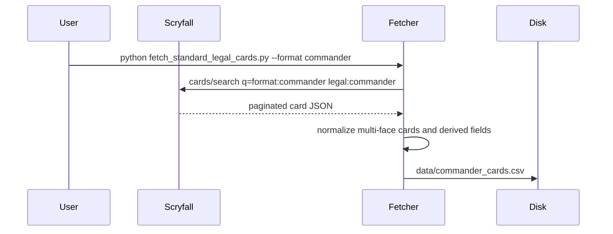

### 18.2 Local Deck Generation

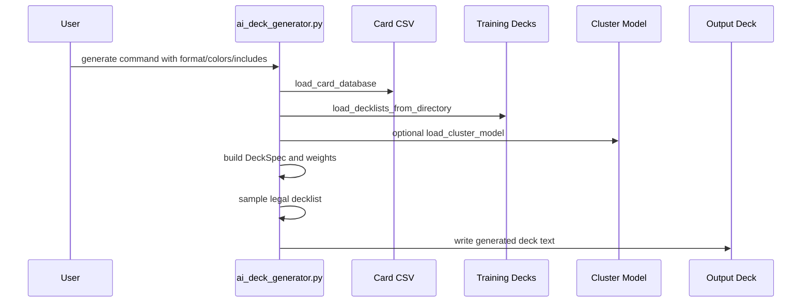

### 18.3 Agentic Research Run

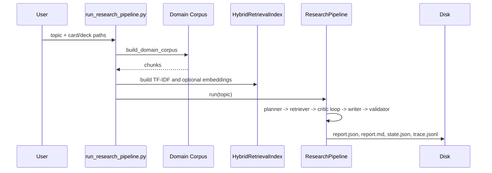

### 18.4 Deployed Backend Recommendation

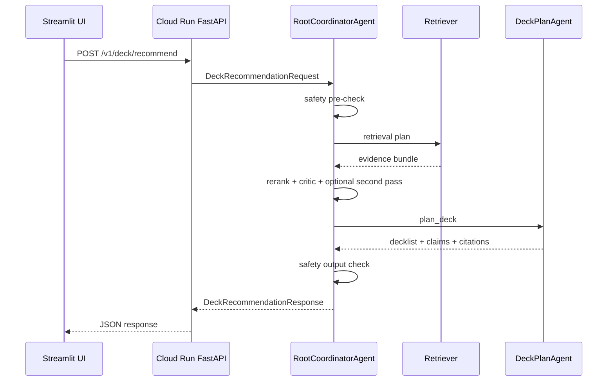

---

## 19. Tests and What They Prove

The tests are a useful guide to intended behavior.

| Test file | Coverage |
|---|---|
| `test_foundation.py` | Decklist parsing, list parsing, split-card normalization, Commander singleton violations. |
| `test_card_name_resolution.py` | Include-card resolution, punctuation-insensitive matching, comma-split recovery. |
| `test_corpus_pipeline.py` | Sparse corpus creation, quality stats, cluster count capping. |
| `test_semantic_weighting.py` | Semantic alignment boosts generator weights. |
| `test_llm_rerank.py` | LLM rerank boosts high-scored candidates and falls back on errors. |
| `test_ui_helpers.py` | UI card-list parsing and deduplication. |
| `test_archidekt_scraper.py` | Archidekt section extraction, formatting, meta ranking, Commander filters. |
| `test_research_retrieval.py` | Lexical retrieval returns relevant chunk. |
| `test_research_pipeline.py` | Full manual pipeline produces report and trace events. |
| `test_research_eval.py` | Eval metrics detect valid citations and dataset loader works. |
| `test_set_aliases.py` | Natural language set aliases and card chunk set context. |
| `test_gcp_adapter_schema.py` | Adapter contract shape and invalid mode rejection. |
| `test_gcp_query_rewrite.py` | Deterministic and diverse query rewrites. |
| `test_gcp_rerank.py` | Merge/rerank deduplicates chunks. |
| `test_gcp_safety.py` | Safety blocks prompt-injection patterns and unsupported modes. |
| `test_gcp_model_routing.py` | Flash/pro routing and lifecycle fallback. |
| `test_gcp_coordinator_integration.py` | Coordinator triggers second pass and returns response schema. |
| `test_vertex_release_gate.py` | Release gate pass/fail behavior. |

Run tests:

```bash
pytest -q
```

---

## 20. Important Design Patterns

### 20.1 Deterministic Fallbacks

The repo often tries advanced behavior and falls back to deterministic behavior:

- Semantic retrieval falls back to lexical retrieval.
- OpenAI synthesis falls back to `RuleBasedLLM`.
- LLM reranking falls back to base weights.
- LangGraph falls back to manual pipeline execution.
- Vertex RAG is separate from local hybrid retrieval.

This makes the repo practical for local testing and CI.

### 20.2 Explicit Contracts

The GCP runtime uses dataclasses for request, response, retrieval plan, evidence, and safety. This reduces ambiguity across UI, backend, and agent runtime.

### 20.3 JSONL Observability

Traces and eval outputs are JSONL. JSONL is easy to append, stream, diff, and inspect.

### 20.4 Artifacts Over Databases

Most system state lives in files:

- CSV for cards,
- TXT for decks,
- JSON for meta reports,
- NPZ for matrices/models,
- JSONL for traces/evals.

This is simple and reproducible but not optimized for concurrent multi-user production workloads.

### 20.5 Separation of Local and Deployed Runtime

The local research pipeline and GCP runtime share retrieval/generation utilities, but their orchestration layers are different:

- Local research pipeline: `ResearchPipeline` with planner/retriever/critic/writer/validator.
- GCP runtime: `RootCoordinatorAgent` with safety/query/retrieve/rerank/critic/deck-plan/safety.

---

## 21. Known Limitations and Engineering Risks

These are not necessarily bugs; they are design constraints a student or AI engineer should understand.

1. Current generator is heuristic and stochastic, not a fully trained neural deckbuilder.
2. Cluster model captures card co-occurrence, but clusters are not automatically labeled or strategically validated.
3. Semantic card weighting uses TF-IDF + SVD, not Magic-specialized embeddings.
4. Research validation uses lexical overlap, which is deterministic but shallow.
5. Some LLM outputs may produce uncited or weakly supported claims, especially with the OpenAI path; eval artifacts show this can happen.
6. Web scrapers depend on external site structures and APIs.
7. The GCP `DeckPlanAgent` records Gemini routing decisions but currently generates decks locally rather than invoking Gemini for deck synthesis.
8. Local artifact storage is simple but not production-grade for high concurrency.
9. Safety gate is regex/pattern-based and should be treated as a baseline guardrail, not a complete security system.
10. The ADK agent tree is deployable scaffolding, while the concrete business logic is still implemented in Python classes and a function tool.

---

## 22. How to Explain the Repo in One Minute

This repo builds an AI-assisted MTG deckbuilder. It first creates local knowledge artifacts: Scryfall cards, scraped decklists, and meta JSON. Then it has two main AI paths. The deck-generation path builds a sparse deck-card corpus, trains KMeans clusters, and generates decks by sampling color-legal cards weighted by meta frequency, cluster fit, optional oracle-text semantic similarity, and optional LLM reranking. The research path builds a RAG corpus from decks, cards, and meta records, retrieves evidence with TF-IDF plus optional sentence-transformer embeddings, runs a planner/retriever/critic/writer/validator loop, and scores groundedness and citations. A Streamlit UI exposes generation, training, research, and chat. A GCP runtime wraps the system with API contracts, safety gates, query rewriting, retrieval, reranking, critique, deck planning, model routing, and deploy scripts for Cloud Run and Vertex AI Agent Engine.

---

## 23. How to Explain the Repo in Five Minutes

Start with data. `fetch_standard_legal_cards.py` calls Scryfall and writes `data/commander_cards.csv`, including derived features like `is_land`, `is_creature`, `color_identity`, and oracle text. Scrapers create `current_commander_decks/*.txt` and meta JSON records. `mtg_io.py` is the shared parser that keeps decklist and card CSV loading consistent.

Then explain analysis. `deck_analysis.py` analyzes one deck: it matches card names, calculates land ratio, creature ratio, mana curve, interaction density, removal density, card advantage ratio, mechanics, archetype scores, and Commander legality. Separate meta scripts analyze the whole metagame using pattern-based, keyword-based, semantic, deck-name, and consolidated methods.

Then explain generation. `deck_corpus_builder.py` turns decklists into a sparse deck-by-card matrix. `train_deck_generator.py` clusters those deck vectors and optionally builds card oracle-text embeddings. `ai_deck_generator.py` takes a `DeckSpec`, filters legal cards by color identity and exclusions, weights cards by training frequency and optional cluster/semantic fit, optionally reranks top candidates with an LLM, then samples a deck while enforcing rough copy rules and land ratio.

Then explain RAG. `research_pipeline/` builds chunks from decklists, cards, and meta JSON. `HybridRetrievalIndex` searches them with TF-IDF and optional semantic embeddings. `ResearchPipeline` uses planner, retriever, critic, writer, and validator nodes. It writes reports, state, and traces. Evals run a set of research topics and compute groundedness, faithfulness, citation precision, and failure type.

Finally explain deployment. `mtg_ui.py` exposes a Streamlit app. `gcp_agent_runtime/` defines a production-style backend: a request contract enters a Cloud Run adapter, flows through safety, query rewriting, retrieval, reranking, critic, deck planner, model routing, and output safety, then returns a typed response. `deploy_agent_engine.py`, Dockerfiles, Docker Compose, and GitHub Actions support Cloud Run and Vertex AI Agent Engine deployment.

---

## 24. Recommended Learning Path for a New Student

Follow this order to master the repo:

1. Read `mtg_io.py` and understand deck/card parsing.
2. Run or inspect `fetch_standard_legal_cards.py` and `archidekt_deck_list_scraper.py` to understand data sources.
3. Read `deck_analysis.py` to understand MTG heuristics and Commander checks.
4. Read `deck_corpus_builder.py` and `train_deck_generator.py` to understand the unsupervised model artifacts.
5. Read `ai_deck_generator.py` to understand how deck generation actually happens.
6. Read `research_pipeline/models.py`, `retrieval/corpus.py`, and `retrieval/index.py` to understand the RAG data model.
7. Read `research_pipeline/graph.py` and `research_pipeline/nodes/*.py` to understand agent orchestration.
8. Read `research_pipeline/validation.py` and `research_pipeline/eval/*` to understand evaluation metrics.
9. Read `mtg_ui.py` and `mtg_ui_app/*.py` to understand user workflows.
10. Read `gcp_agent_runtime/contracts.py`, `coordinator.py`, and `adk_app.py` to understand production deployment architecture.
11. Read `tests/` to see the intended behavior locked down by unit tests.
12. Run `pytest -q` after installing development dependencies.

---

## 25. Quick Command Reference

Install core dependencies:

```bash
pip install -r requirements.txt
```

Install dev dependencies:

```bash
pip install -r requirements-dev.txt
```

Run tests:

```bash
pytest -q
```

Run UI:

```bash
pip install -r requirements-ui.txt
streamlit run mtg_ui.py
```

Run Docker Compose:

```bash
docker compose up --build
```

Fetch cards:

```bash
python fetch_standard_legal_cards.py --format commander
```

Scrape Archidekt Commander decks:

```bash
python archidekt_deck_list_scraper.py --format commander --min-meta 0.2 --top-k 500
```

Analyze one deck:

```bash
python deck_analysis.py path/to/deck.txt --cards data/commander_cards.csv
```

Build corpus:

```bash
python deck_corpus_builder.py --cards data/commander_cards.csv --decks current_commander_decks --output-prefix data/deck_corpus
```

Train model:

```bash
python train_deck_generator.py --corpus-prefix data/deck_corpus --cards data/commander_cards.csv --output-prefix models/deck_kmeans
```

Generate deck:

```bash
python ai_deck_generator.py --cards data/commander_cards.csv --training-decks current_commander_decks --cluster-model models/deck_kmeans --format commander --colors WR --size 100
```

Run research pipeline:

```bash
python run_research_pipeline.py "What interaction package sizes are common in commander?" --cards data/commander_cards.csv --decks current_commander_decks
```

Run eval:

```bash
python run_research_eval.py --dataset eval/topics.jsonl --cards data/commander_cards.csv --decks current_commander_decks
```

Run release gate:

```bash
python eval/vertex_release_gate.py --results eval_runs/<timestamp>/results.jsonl
```

Run backend adapter locally:

```bash
python run_backend_adapter.py
```

Deploy Agent Engine dry run:

```bash
python deploy_agent_engine.py --project "$PROJECT_ID" --location us-central1 --staging-bucket "gs://$STAGING_BUCKET" --dry-run
```

---

## 26. Final Mental Model

If you remember only one architecture, remember this:

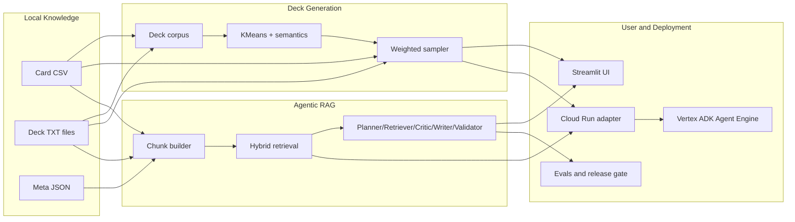

The repo is best understood as an artifact-based AI application: build local knowledge, transform it into ML/retrieval structures, generate or research with those structures, validate outputs, and expose workflows through UI and GCP deployment layers.

---

## 27. File-by-File Appendix

This appendix is a quick reference for explaining what each important file does.

### 27.1 Root Runtime and Data Scripts

| File | Role |
|---|---|
| `mtg_io.py` | Shared decklist/card CSV parser and normalizer. Central utility used by analysis, generation, corpus, and retrieval paths. |
| `ui_helpers.py` | Small UI-oriented helper for parsing comma/newline card input. |
| `fetch_standard_legal_cards.py` | Scryfall ingestion script that writes format-legal card CSVs. |
| `current_standard_deck_list_scraper.py` | MTGGoldfish scraper for metagame decklists and meta JSON. Filename is legacy; supports configured formats. |
| `archidekt_deck_list_scraper.py` | Archidekt API scraper for recent decklists with Commander-aware section and size validation. |
| `deck_analysis.py` | Single-deck analysis, mechanics extraction, archetype scoring, and Commander compliance checks. |
| `deck_corpus_builder.py` | Builds sparse deck-by-card matrix, deck color vectors, vocabulary, and corpus metadata. |
| `train_deck_generator.py` | Trains MiniBatchKMeans deck clusters and optional oracle-text semantic vectors. |
| `ai_deck_generator.py` | Generates decklists from color filters, training frequency, optional cluster/semantic weighting, and optional LLM rerank. |
| `run_research_pipeline.py` | Thin CLI wrapper that calls `research_pipeline.run_pipeline.main`. |
| `run_research_eval.py` | Thin CLI wrapper that calls `research_pipeline.eval.run_eval.main`. |
| `run_backend_adapter.py` | Starts the FastAPI backend adapter with uvicorn. |
| `deploy_agent_engine.py` | Deploys the ADK app to Vertex AI Agent Engine, or prints dry-run payload. |
| `sync_rag_corpus.py` | Exports RAG corpus chunks as JSONL and optionally uploads to GCS. |

### 27.2 Streamlit UI Package

| File | Role |
|---|---|
| `mtg_ui.py` | Streamlit entry point. Creates the four UI tabs. |
| `mtg_ui_app/__init__.py` | Package marker. |
| `mtg_ui_app/shared.py` | Shared Streamlit caching, retrieval index building, backend calls, chat synthesis, and artifact writing. |
| `mtg_ui_app/generate_tab.py` | Deck generation UI, including local generation and optional deployed backend mode. |
| `mtg_ui_app/train_tab.py` | UI wrapper around corpus building and model training commands. |
| `mtg_ui_app/agentic_tab.py` | UI for running planner/retriever/critic/writer/validator research reports. |
| `mtg_ui_app/chat_tab.py` | Retrieval-grounded chat interface over local deck/card/meta corpus. |

### 27.3 Research Pipeline Package

| File | Role |
|---|---|
| `research_pipeline/__init__.py` | Package marker. |
| `research_pipeline/models.py` | Dataclasses for document chunks, retrieved chunks, citations, claims, and structured reports. |
| `research_pipeline/graph.py` | `ResearchPipeline` state machine with optional LangGraph execution and manual fallback. |
| `research_pipeline/llm.py` | `AgentLLM`, deterministic `RuleBasedLLM`, OpenAI-compatible LLM wrapper, and default LLM selection. |
| `research_pipeline/trace.py` | JSONL trace logger for pipeline and node-level events. |
| `research_pipeline/grounding.py` | Tokenization and lexical-overlap support scoring. |
| `research_pipeline/validation.py` | Report validation metrics: groundedness, faithfulness, citation precision, recall. |
| `research_pipeline/reporting.py` | Converts structured report dictionaries to Markdown. |
| `research_pipeline/run_pipeline.py` | Full CLI implementation for single-topic research runs. |
| `research_pipeline/set_aliases.py` | Natural-language set name/code alias handling for retrieval/chat. |
| `research_pipeline/retrieval/__init__.py` | Retrieval package marker. |
| `research_pipeline/retrieval/corpus.py` | Builds `DocumentChunk` corpus from decks, card CSV, and meta JSON. |
| `research_pipeline/retrieval/index.py` | Hybrid TF-IDF plus optional sentence-transformer retrieval index. |
| `research_pipeline/nodes/__init__.py` | Node package marker. |
| `research_pipeline/nodes/planner.py` | Planner node implementation. |
| `research_pipeline/nodes/retriever.py` | Retriever node implementation. |
| `research_pipeline/nodes/critic.py` | Evidence sufficiency critic node. |
| `research_pipeline/nodes/writer.py` | Report writer node. |
| `research_pipeline/nodes/validator.py` | Report validation node. |
| `research_pipeline/eval/__init__.py` | Eval package marker. |
| `research_pipeline/eval/dataset.py` | JSON/JSONL eval case loader. |
| `research_pipeline/eval/metrics.py` | Eval metric and failure-classification helpers. |
| `research_pipeline/eval/run_eval.py` | Full eval runner that produces `results.jsonl`, `summary.md`, `failure_analysis.md`, and traces. |

### 27.4 GCP Runtime Package

| File | Role |
|---|---|
| `gcp_agent_runtime/__init__.py` | Exports public runtime classes/contracts. |
| `gcp_agent_runtime/contracts.py` | Request, response, retrieval, evidence, citation, and safety dataclass contracts. |
| `gcp_agent_runtime/adapter.py` | Cloud Run/FastAPI adapter from raw JSON to coordinator response. |
| `gcp_agent_runtime/coordinator.py` | Production-style coordinator for safety, query rewrite, retrieve, rerank, critique, deck plan, and response. |
| `gcp_agent_runtime/query_rewrite.py` | Deterministic query rewrite and `RetrievalPlan` builder. |
| `gcp_agent_runtime/retrieval.py` | Local hybrid retriever, Vertex RAG retriever, and retrieval agent wrapper. |
| `gcp_agent_runtime/rerank.py` | Evidence rescoring and bundle merge/dedup logic. |
| `gcp_agent_runtime/critic.py` | Coverage critic and second-pass retrieval trigger. |
| `gcp_agent_runtime/deck_plan.py` | Deck planning bridge to local generator, model routing, claims, and citations. |
| `gcp_agent_runtime/safety.py` | Deterministic safety policy checks for request and output text. |
| `gcp_agent_runtime/model_routing.py` | Flash/pro model selection and model lifecycle fallback guard. |
| `gcp_agent_runtime/telemetry.py` | Vertex and LangSmith OpenTelemetry environment variable helper. |
| `gcp_agent_runtime/adk_app.py` | ADK `LlmAgent` tree and Vertex Agent Engine app factory. |

### 27.5 Top-Level Eval Helpers

| File | Role |
|---|---|
| `eval/__init__.py` | Package marker. |
| `eval/topics.jsonl` | Starter eval dataset with 24 MTG research cases. |
| `eval/vertex_release_gate.py` | Offline release gate over aggregate eval metrics. |
| `eval/langsmith_fanout.py` | Prints LangSmith/OpenTelemetry environment configuration. |

### 27.6 Docs, Config, Docker, and CI

| File | Role |
|---|---|
| `README.md` | Main project overview, setup, workflows, and architecture highlights. |
| `docs/gcp_adk_vertex_deployment.md` | GCP ADK, Cloud Run, Agent Engine, corpus sync, security, and eval deployment notes. |
| `docs/eval_dataset.md` | Eval dataset schema, category distribution, and failure-analysis template. |
| `docs/failure_analysis.md` | How to inspect eval artifacts and iterate on failures. |
| `docs/repository_master_report.md` | This detailed master report. |
| `requirements.txt` | Core project dependencies. |
| `requirements-ui.txt` | Streamlit UI dependencies. |
| `requirements-gcp.txt` | Cloud Run, ADK, Vertex, and GCS dependencies. |
| `requirements-dev.txt` | Test/development dependencies. |
| `.env.example` | Local environment variable template. |
| `.gitignore` | Git ignore rules. |
| `.dockerignore` | Docker build ignore rules. |
| `Dockerfile.ui` | Streamlit UI container. |
| `Dockerfile.backend` | FastAPI backend adapter container. |
| `docker-compose.yml` | Local two-service UI plus backend runtime. |
| `.github/workflows/ci.yml` | Test CI workflow. |
| `.github/workflows/deploy-gcp.yml` | Manual GCP deployment workflow. |
| `LICENSE` | MIT license. |

### 27.7 GCP Infrastructure Notes

| File | Role |
|---|---|
| `infra/gcp/README.md` | IAM, rollout, CI/CD, and policy rollout notes. |
| `infra/gcp/sgp_policy_example.sh` | Example semantic governance policy creation script. |
| `infra/gcp/agent_gateway_policy_test.sh` | Agent Gateway dry-run policy validation script (log-based checks). |

### 27.8 Tests

| File | Role |
|---|---|
| `tests/test_foundation.py` | Shared parsing and Commander legality checks. |
| `tests/test_card_name_resolution.py` | Include/exclude name resolution and generator include behavior. |
| `tests/test_corpus_pipeline.py` | Corpus matrix and KMeans training behavior. |
| `tests/test_semantic_weighting.py` | Semantic weighting in generator cluster weights. |
| `tests/test_llm_rerank.py` | LLM rerank and fallback behavior. |
| `tests/test_ui_helpers.py` | UI card-list parsing. |
| `tests/test_archidekt_scraper.py` | Archidekt scraper parsing, formatting, ranking, and filters. |
| `tests/test_research_retrieval.py` | Hybrid retrieval lexical relevance. |
| `tests/test_research_pipeline.py` | End-to-end research pipeline and trace events. |
| `tests/test_research_eval.py` | Eval metrics and dataset loader. |
| `tests/test_set_aliases.py` | Set alias extraction and card chunk set context. |
| `tests/test_gcp_adapter_schema.py` | Backend adapter schema and mode validation. |
| `tests/test_gcp_coordinator_integration.py` | Coordinator second-pass integration and response shape. |
| `tests/test_gcp_model_routing.py` | Model routing and lifecycle fallback. |
| `tests/test_gcp_query_rewrite.py` | Query rewrite determinism and diversity. |
| `tests/test_gcp_rerank.py` | GCP runtime rerank merge/dedup. |
| `tests/test_gcp_safety.py` | Prompt-injection and unsupported-mode blocking. |
| `tests/test_vertex_release_gate.py` | Release gate threshold behavior. |

### 27.9 Local Artifact Directories

| Directory | Role |
|---|---|
| `data/` | Card CSV and deck corpus matrix/metadata artifacts. |
| `current_commander_decks/` | Local Commander decklist text files. |
| `json_outputs/` | Scraper and meta-analysis JSON outputs. |
| `models/` | Trained cluster model artifacts. |
| `generated_decks/` | Generated decklist examples. |
| `runs/` | Agentic research run outputs. |
| `eval_runs/` | Created when eval harness runs; not necessarily present until generated. |
| `rag_exports/` | Created by corpus sync exports; not necessarily present until generated. |
